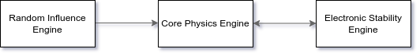

# Electronic Stability Control
Electronic Stability Control for Vehicle Dynamics.

  
## Overview
  

  
***Core Physics Engine (CPE)*** senses/calculates and provides telemetry of vehicle.  
It is also capable of controlling active components in the vehicle that can alter vehicle dynamics to adhere to ideal trajectory.  
  
***Random Influence Engine (RIE)*** sends randomized effects to CPE to alter vehicle dynamics.  
These randomized effects, beyond a threshold dependent on vehicle kinematics, will influence the trajectory of the vehicle.  
This simulates what would normally happen in the real world. For example, a strong gust of wind often affects trajectory of aircraft in flight, perceived as turbulence. Here, the gust is a random environmental effect that influences vehicle dynamics. 
   
***Electronic Stability Engine (ESE)*** receives current telemetry (affected by RIE) and ideal telemetry from CPE.  
ESE calculates delta between target trajectory and current trajectory, and sends correction vectors (if any) to CPE.
  
## Vehicle Telemetry
  
Vehicle telemetry (velocity/acceleration) is provided as a 3D vector:  
    
(x)*i* + (y)*j* + (z)*k*  
  
x, y, and z are magnitudes of components in each of the 3 dimensions.  
These dimensions, *i*, *j* and *k*, are usually pitch, yaw and roll.  
They can also denote linear motion, lateral motion, and rotational motion.  

## Correction Vector
  
Correction Vector (CV) provided by ESE will also be in format of vehicle telemetry i.e. a 3D Vector.  
CPE interprets this as changes to be made in each component of 3D motion.  
For example, following are some CVs and their possible meanings:
- 2*i* + 0*j* + 0*k* -> increasing the speed by 2km/h,  
- -2*i* + 0*j* + 0*k* -> decreasing the speed by 2km/h,  
- 0*i* - 5*j* + 0*k* -> turning left by 5 degrees,  
- 0*i* + 5*j* + 0*k* -> turning right by 5 degrees.

## Installation

```
git clone https://github.com/oishikm/electronic-stability-control.git
cd electronic-stability-control
make
```

## Running Electronic Stability Control Simulation

```
./xesc run
```
This runs the simulation with default presets and thresholds. To run with own parameters, refer to the section(s) underneath.

## Running with Parameter Changes

You can change RIE and CPE Parameters and Thresholds. The following commands outline what can be changed, and how they can be changed.

- ### Random Influence Engine (RIE) Parameter Changes

  ```
  ./xesc modify RIE
  ```

- ### Core Physics Engine (CPE) Parameter Changes

  ```
  ./xesc modify CPE
  ```

- ### Running after Parameter Changes
  ```
  ./xesc run
  ```