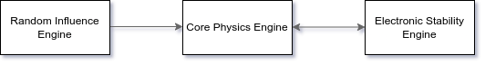

# Electronic Stability Control
Electronic Stability Control for Vehicle Dynamics.

  
## Overview
  

  
***Core Physics Engine (CPE)*** senses/calculates and provides telemetry of vehicle.  
It is also capable of controlling active components in the vehicle that can alter vehicle dynamics to adhere to ideal trajectory.  
  
***Random Influence Engine (RIE)*** sends randomized effects to CPE to alter vehicle dynamics.  
These randomized effects, beyond a threshold dependent on vehicle kinematics, will influence the trajectory of the vehicle.  
This simulates what would normally happen in the real world. For example, a strong gust of wind often affects trajectory of aircraft in flight, perceived as turbulence. Here, the gust is a random environmental effect that influences vehicle dynamics. 
   
***Electronic Stability Engine (ESE)*** receives current telemetry (affected by RIE) and ideal telemetry from CPE.  
ESE calculates delta between target trajectory and current trajectory, and sends correction vectors (if any) to CPE.

## Installation

```
git clone https://github.com/oishikm/electronic-stability-control.git
cd electronic-stability-control
make
```
Installation requires gcc, python and [pyinstaller](https://pypi.org/project/pyinstaller/).

## Running Electronic Stability Control Simulation

```
./xesc run
```
This runs the simulation with default presets and thresholds. To run with own parameters, refer to the section(s) underneath.

## Running with Parameter Changes

You can change RIE and CPE Parameters and Thresholds. The following commands outline what can be changed, and how they can be changed. The parameter information is also available in the [Wiki](https://github.com/oishikm/electronic-stability-control/wiki).

- ### Random Influence Engine (RIE) Parameter Changes

  ```
  ./xesc modify RIE
  ```

- ### Core Physics Engine (CPE) Parameter Changes

  ```
  ./xesc modify CPE
  ```

- ### Running after Parameter Changes
  ```
  make newcfg
  ./xesc run
  ```

## Further Reading
Visit the [Wiki](https://github.com/oishikm/electronic-stability-control/wiki) for more information.